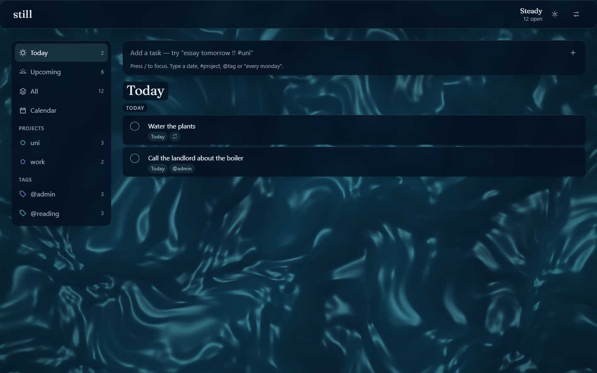
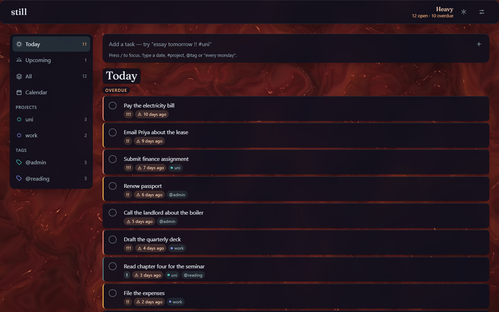
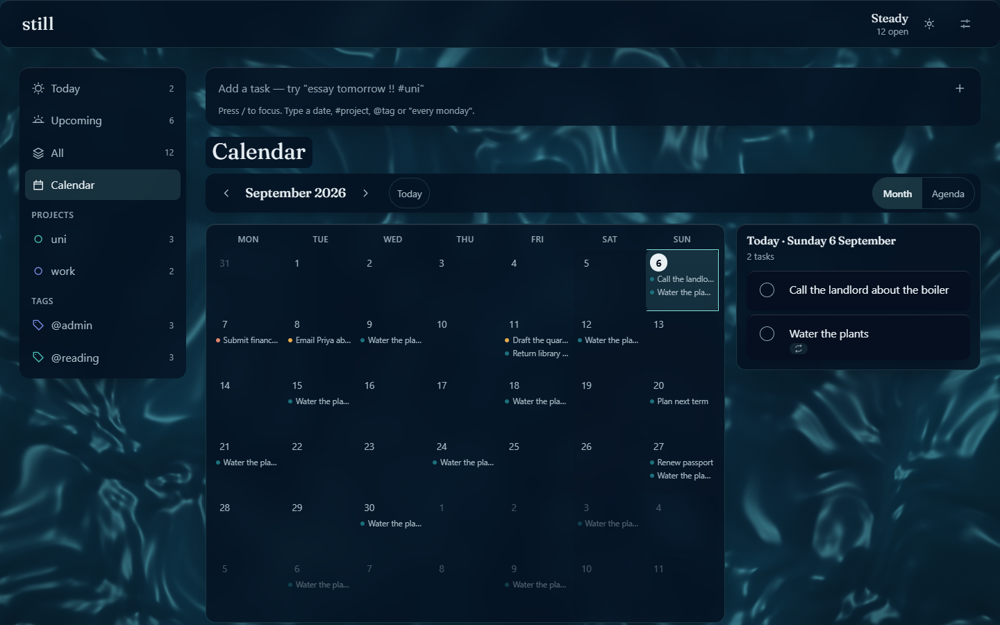
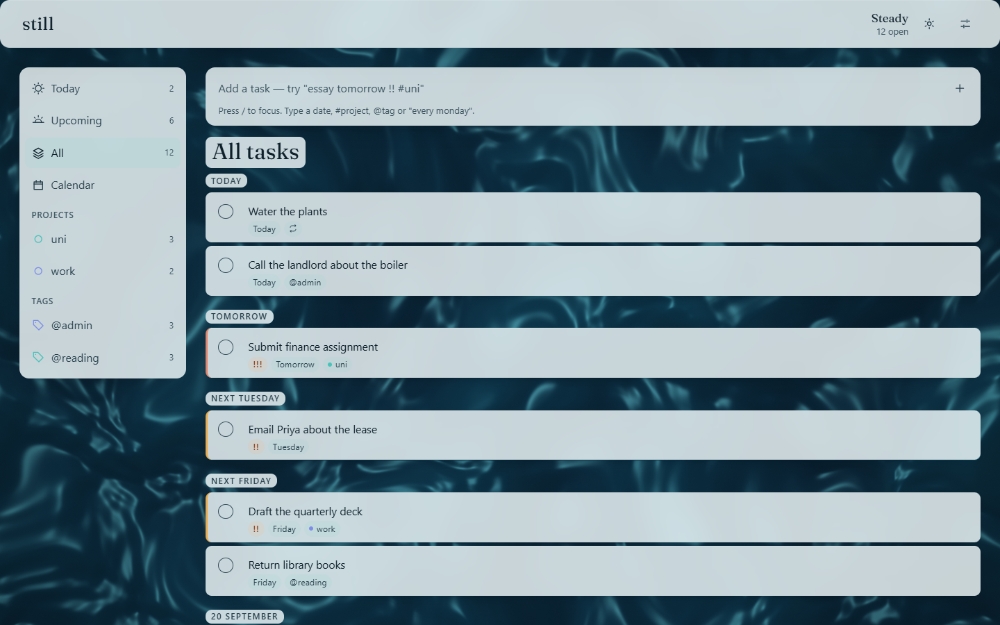

# Still

A todo list that calms down when you do.

The background is a live WebGL2 fluid surface driven by your actual backlog. An
empty list is flat, slow, cool water. Tasks accumulate and the surface gains
frequency and amplitude. Something goes overdue and it heats and roils.
Completing a task sends a ripple out from the checkbox you tapped.

The reward for clearing your list is stillness — not a streak counter, not
confetti. The shader is load-bearing: it reports a real number about your
workload that you can read without reading anything.

**[Live demo →](https://samarth5704.github.io/still/)**  ·  [the surface on its
own, with sliders →](https://samarth5704.github.io/still/shader.html)



<table>
<tr>
<td width="50%"></td>
<td width="50%"></td>
</tr>
<tr>
<td>Ten things late. The header says <em>Heavy · 10 overdue</em>; the surface says the same thing without words.</td>
<td>The calendar reads recurrence <em>rules</em>, not materialised tasks.</td>
</tr>
</table>



## What it does

- **Quick add that parses what you type.** `Submit finance assignment tomorrow
  !!! #uni @admin`, `Standup every weekday at 9am`, `Water the plants every 3
  days`. Dates, times, priorities, projects, tags and recurrence rules, claimed
  in a fixed order so `every monday` is a rule rather than a due date.
- **Recurrence that stores a rule.** Ticking a repeating task finishes one
  occurrence and moves the task to the next one. Editing offers *this
  occurrence*, *this and all future*, or *the whole series*.
- **A month grid and an agenda**, both built from the same one-pass window over
  the rules.
- **Subtasks**, one level deep and deliberately not a tree.
- **Projects and tags**, archivable so a name you filed something under stays
  resolvable forever.
- **Everything local.** No backend, no account, no sync. `localStorage`, and it
  opens read-only rather than overwriting data from a newer version of itself.

## Running it

```bash
npm install
npm run dev
```

| | |
|---|---|
| `npm run dev` | the app at `localhost:5173`, and `/shader.html` for the surface lab |
| `npm test` | 600 Vitest tests, mostly over the pure `lib/` |
| `npm run typecheck` | `tsc --noEmit`, strict |
| `npm run contrast` | sweeps the shader's whole palette range against every ink |
| `npm run build` | typecheck, then Vite |
| `npm run deploy:check` | fails on any top-level build output not on the allowlist |

CI runs all six and deploys to Pages from `main`.

## Built from scratch

Vite and TypeScript, and nothing else at runtime. No React, no CSS framework,
no component library, no animation library, no date library, no state library,
no shader library. The GLSL, the icons, the recurrence engine, the date
handling and the quick-add parser are all in this repo. The only external
runtime resource is a Google Fonts `<link>`.

```
src/lib/     pure logic — dates, recurrence, pressure, parsing, storage
src/gl/      the shader, its palette, its ripple buffer, the contrast model
src/app/     the views, the store, the dialogs
scripts/     the contrast gate and the deploy allowlist
docs/        performance.md, accessibility.md, og.md — the measurements and recipes
```

`lib/` reads no DOM, no globals and no clock: every function takes its inputs
explicitly, including today's date. That is most of why the test suite can be
this large and this fast.

---

## Design notes

### Why pressure saturates instead of scaling linearly

Pressure is `1 - exp(-load / k)`, where load is a weighted sum over open tasks —
priority times urgency, with overdue weighing heaviest.

A linear scale would need a maximum, and there isn't one. Twelve tasks is a
busy week; two hundred is a backlog you have stopped looking at; a linear map
would either flatten the twelve into nothing or saturate at the two hundred and
throw away every distinction below it. Saturation puts the resolution where the
decisions are: the difference between three tasks and eight is plainly visible,
the difference between eighty and ninety is not, and that is the correct shape,
because at eighty the answer is the same either way.

It also means the surface can never max out and stay maxed out. There is always
a little further to go, and every completion moves it back.

### Why pressure and heat are two channels, not one

They are different questions. *How much is on the plate* and *how much of it is
late* do not vary together and do not mean the same thing: a full list you are
on top of is not the same situation as an empty one you have already missed.

So they drive different things and never each other's. Pressure moves the
surface — frequency, warp, flow speed, relief, and where it rests on its ramp.
Heat chooses the palette — cool teal through plum to oxblood and amber. A late
list is warm whether it is long or short; a long list is dense whether it is
late or not.

The middle stop exists for a reason worth stating: interpolating teal straight
into oxblood passes through grey, because they are near-opposite hues and the
midpoint of a componentwise mix is desaturated mud. Half your load being late is
a common state and it has to look like heating up, not like the screen died.
Routing through plum keeps the path saturated the whole way, and the contrast
script checks the whole path rather than the ends.

### Why recurrence stores a rule, and what "this and future" does to it

A repeating task is **one task and one rule**, never a generated list. The
task's `due` is the occurrence it is currently sitting on. Ticking it records a
`completed` exception against that date and walks `due` forward to the next one;
running out of occurrences is the only thing that sets `done`.

Materialising instances is the tempting alternative and it is wrong in a way
that compounds. "Every Monday, forever" has no last instance, so a materialising
implementation has to pick a horizon, and then it owns the horizon: what happens
at the edge, what happens when you scroll past it, what happens to the three
hundred rows it wrote when you change the rule. Every generator here takes an
explicit window and a hard cap instead, and nothing can ask for an unbounded
series.

**"This and all future" splits the rule.** The original ends the day before the
occurrence you are editing; a new rule starts on that day carrying the change.
If the original had an `ends: after N` you did not touch, the new rule gets the
*remaining* count, not `N` restated — you asked for ten and skipping one is not
a reason to get eleven. The truncated original is kept only if it carries
exceptions worth keeping; a husk no task points at can never be rendered, so
keeping it would be a leak with a UI.

Because a skip consumes one of that count, the UI shows a **position** — "3 of
10 scheduled" — and never a remainder. "7 left" would be quietly wrong the first
time you skipped one.

### Why the shader is hand-written

Three libraries were studied and none imported; the acknowledgements below say
what each one contributed. The reason to write it is that the shader is the
product. It has to be a function of two specific numbers this app computes,
tuned so that *calm* is reliably calm and *late* is unmistakable, and driven by
uniforms the rest of the app already owns. A parameter space designed for
someone else's gradient is a starting point for a look, not for a signal.

The engineering is the same argument. The noise carries its own analytic
derivative, so the surface normal is free — central differences would have
tripled the noise evaluations for the same picture. The palette is uploaded
from TypeScript rather than hard-coded in GLSL, so `gl/palette.ts` is the one
definition the shader, the CSS fallback and the contrast script all read.
Neither of those decisions is available if the shader arrives as a dependency.

It is 252 lines. A library that draws a nice gradient would have been more code
in the bundle and less of it about this app.

### How contrast is verified across a moving background

A screenshot proves one pixel at one instant. The background moves, so contrast
here is a **range**, and the question is whether the floor of that range clears
4.5:1 — everywhere in it.

`scripts/contrast.ts` answers it without a browser and without a GPU:

1. **Bound the surface.** `gl/contrast.ts` mirrors the fragment shader's
   arithmetic — the ramp, the resting level, the relief, the diffuse wrap, the
   specular gain, the fresnel term, the vignette, the dither — and computes the
   brightest and darkest pixel the shader can produce at a given pressure and
   heat. It does not reimplement the noise: the noise only ever *supplies* a
   height in a known range and a unit normal, so those are swept directly and
   the noise drops out of the question.
2. **Sweep the space.** 21 × 21 points of pressure × heat, both extremes at
   each. The two worst cases are opposite corners: a busy, late list throwing a
   bright crest under pale text, and a calm, clear one sitting dark under dark
   text. Checking the hot corner alone would pass a stylesheet that is
   unreadable when your list is empty — which is the state this app is trying to
   get you to.
3. **Put the chrome on top.** The scrim's colour and alpha, the `saturate(1.4)`
   of the backdrop filter, and the three washes painted over the scrim, all
   parsed out of `src/style.css` rather than restated. Blur is deliberately not
   modelled: an average of a set of colours cannot fall outside that set.
4. **Fail the build.** Any ink under 4.5:1 anywhere in the range fails, and so
   does any token in the palette that is neither checked as an ink nor listed
   as an exemption with a reason. A new colour cannot arrive without a decision
   about its contrast.

It found three real failures the day it was written. `--ink-faint` read 3.70:1
in the dark theme and 2.86:1 in the light one, and the light theme's `--warn`
read 3.45:1 — all three had been chosen against a still gradient and none of
them survived a crest. The values in the stylesheet now are the ones the sweep
says hold, and the script is why they will stay that way.

Two structural tests sit underneath it. `src/style.test.ts` guards the shape of
the stylesheet — every rule inside a cascade layer, the scrim defined once, the
light theme's two blocks saying the same thing. `src/app/scrim.test.ts` boots
the real app, walks every element carrying a text node in every view and dialog,
and requires each one to reach a scrim before it reaches the page — with the set
of scrim-bearing classes derived from the stylesheet, so a new surface registers
itself. Neither can resolve a cascade under happy-dom, which is why the contrast
question is a script and not a test.

### Why the link preview is the surface

`public/og.jpg` is a 1200 x 630 frame of this project's own shader, captured
from `/shader.html?capture&pressure=0.35&heat=0&time=6` — not a wordmark, not a
composite, and not made in another tool. An app whose entire idea is that the
background reports your backlog should preview as that background.

The capture is a recipe rather than a file someone still has: capture mode
seeds the lab's real sliders, pins the clock with `Surface.seek()` so the frame
is reproducible, and regenerating it after a palette change is one command. It
is written down in **[docs/og.md](docs/og.md)**, along with the recipe for the
screenshots at the top of this file.

Capturing it found a bug that had been in the surface lab since Phase 2: the CSS
fallback div, `hidden` but styled `display: block`, had been covering the canvas
for six phases. Four captures at four different settings came back identical,
byte for byte, which is a much louder signal than the page ever gave anyone
looking at it.

### And the performance budget

Measured, not asserted: **[docs/performance.md](docs/performance.md)**. The
short version is that the shader costs 9.6ms per megapixel on an integrated
Intel GPU, which is 28ms per frame at 1440×900 with DPR 1.5 — seven times over
budget — so the renderer now measures its own GPU time and gives back
resolution until it fits. It settles at 0.65 scale and 3.78ms on that machine,
and the surface it draws is a smooth low-frequency field that the compositor
upscales for nothing.

---

## Accessibility

- **The shader carries information, so it has a text equivalent.** A
  visually-hidden live region says "Steady. 12 open tasks, 3 overdue." and
  updates when the number changes, not when the frame does. The header says the
  same thing in the same words, visibly.
- **An effects preference with four values, and `auto` is the default.** Only
  `auto` follows `prefers-reduced-motion`; `full`, `reduced` and `off` outrank
  the OS in both directions. With three values an explicit `full` cannot be told
  from a default `full`, so honouring the OS would overrule someone who asked
  for motion and ignoring it would overrule someone who asked for none. The
  theme preference has the same shape for the same reason.
- **`reduced` is not `off`.** It damps flow, warp and ripples to nothing while
  frequency, relief and palette still follow pressure and heat. Stillness
  removes motion, never information. `off` stops the render loop rather than
  hiding it.
- Full keyboard operation with a visible `:focus-visible` at every stop.
  `<dialog>` traps focus and gives it back to the control that opened it — or,
  when that control no longer exists, to a named fallback inside the same modal.
- Task rows are `<li>` in a `<ul>` with real `<button>` controls, each named in
  context: "Complete: Submit finance assignment, due tomorrow", not the three
  hundredth identical "Complete".
- Nothing is conveyed by colour alone. Priority is a mark as well as an edge
  colour; today is a filled disc plus `aria-current`; a completed calendar
  occurrence is an open ring and a word; the calendar's layout switch is marked
  by weight and ground, not hue.
- Completion and undo are announced politely, coalesced on a short timer so a
  run of completions is one sentence rather than five interruptions.
- 44 × 44px targets and no horizontal scroll down to 320px, both measured. The
  full audit, including the one recorded exemption and why it is one, is in
  **[docs/accessibility.md](docs/accessibility.md)**.

## Deploying

The build publishes an explicit allowlist rather than uploading `dist/` blind.
`scripts/deploy-manifest.ts` names every top-level entry with a reason and fails
the build on anything else, so a scratch page cannot reach a public URL by
accident. `shader.html` is on the list deliberately: it is a development tool
that ships, because dragging the pressure slider is the fastest explanation of
what this project is, but the app never links to it and it carries a `noindex`.

## Acknowledgements

Three MIT-licensed repositories informed this project. None of them is a
dependency, and the distinction matters in both directions.

- **[collidingScopes/liquid-logo](https://github.com/collidingScopes/liquid-logo)**
  — read for how it turns a flat mark into liquid, which is where the idea of a
  wordmark that belongs on this surface came from. Nothing from it is in the
  repo in the end: the wordmark is live text set in Fraunces, so it stays
  selectable and reflows, and the favicon is two hand-drawn SVG paths. It is
  credited because the influence is real, not because an asset shipped.
- **[dashersw/liquid-glass-js](https://github.com/dashersw/liquid-glass-js)** —
  studied for its refraction approach, and deliberately not imported. It samples
  the page through html2canvas, which is untenable behind a list that changes on
  every keystroke, and its `Button` class produces a canvas-backed element
  rather than a real `<button>`. The glass here is `backdrop-filter` over real
  DOM, and the tinted shadow is derived from the palette rather than read back
  from the framebuffer — a GPU readback per paint is exactly what that library
  was studied for and rejected over.
- **[ruucm/shadergradient](https://github.com/ruucm/shadergradient)** — studied
  for its parameter space. Not a dependency.

Borrowing ideas and crediting them is normal. Implying you wrote something you
imported is not, and implying you imported something you wrote sells yourself
short.
